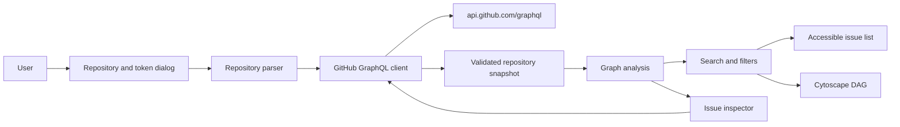

# Application architecture and GitHub data

## Architecture summary

The product is a static browser application. GitHub Pages serves immutable HTML, JavaScript, and CSS. The browser calls GitHub GraphQL, validates responses, constructs the domain graph, and renders both HTML and canvas views.



No server, proxy, database, analytics service, or secret store is part of the runtime.

## Module boundaries

```text
src/
├── components/        # Primer application surfaces and graph adapter
├── demo/              # implementation blueprint and offline repository projection
├── domain/            # repository-independent types, graph analysis, and filters
├── github/            # input parsing, response schemas, and GraphQL transport
├── hooks/             # browser UI state such as color mode
└── styles/            # shell, graph, detail, and responsive styling
```

Dependencies point inward:

```text
GitHub and Cytoscape adapters -> application components -> domain contracts and algorithms
```

Domain modules do not import React, Primer, Cytoscape, browser storage, or GitHub response schemas.

## Repository parsing

The parser converts every supported input to:

```ts
interface RepositoryRef {
  owner: string
  name: string
  nameWithOwner: string
  url: string
}
```

The parser accepts only the `github.com` host, validates owner and repository segments, strips `.git`, and ignores path segments after the repository. The repository query parameter may contain `owner/name`; a token must never be placed in a query parameter.

## GraphQL ingestion

### Repository snapshot query

Fetch issues in ascending creation order with pages of 100. Each issue includes:

- Stable node ID, number, title, URL, state, state reason, and timestamps.
- Author and up to 20 assignees.
- Up to 50 labels and an optional milestone.
- Up to 100 `blockedBy` nodes and up to 100 `blocking` nodes.
- `totalCount` for both dependency connections.
- Repository identity for every dependency node.

The client follows `pageInfo.endCursor` until `hasNextPage` is false and reports progress after each page.

### Lazy issue detail query

Issue bodies are not part of the bulk query. Selecting a local issue requests its body once and stores it in the in-memory snapshot. External synthesized nodes link to their source issue and do not trigger a body query against the current repository.

### Validation boundary

Zod schemas validate the complete GraphQL `data` shape before transformation. A missing repository, GraphQL error, non-success HTTP status, invalid payload, abort, or inaccessible issue produces a bounded user-facing error. Raw response bodies and authorization values are never interpolated into application errors.

## Dependency truncation

If `totalCount` exceeds the number of returned dependency nodes, set `dependencyDataTruncated` on the issue. The UI displays a repository-level warning because readiness and reachability involving that node may be incomplete.

The first release does not paginate each nested dependency connection. Doing so requires a different query strategy with one connection cursor per issue and must be justified by observed repositories.

## State ownership

- React state owns the current snapshot, source mode, filters, selection, layout direction, progress, and visible mobile panels.
- A ref owns the active token and current load abort controller.
- The URL owns only the optional canonical repository name.
- No application state is written to local storage, session storage, IndexedDB, cookies, or service-worker caches.

## Failure behavior

| Failure | Required behavior |
| --- | --- |
| Invalid repository input | Keep the dialog open and show a specific parsing error. |
| Empty token | Do not send a request. |
| Token lacks access | Show repository-not-found-or-inaccessible without exposing credentials. |
| GraphQL schema drift | Reject the payload and show an unexpected-response error. |
| Load is superseded | Abort the prior request and ignore its completion. |
| Issue disappears before body load | Keep graph data and report that the selected issue is unavailable. |
| Dependency connection is partial | Render retrieved relationships and show a persistent warning. |
| Dependency cycle exists | Keep all nodes, style cycle membership, and expose cycle filters/statistics. |

## Static build and deployment

Vite builds relative asset URLs for project Pages. GitHub Actions performs the verified build, uploads the Pages artifact, and deploys it with official GitHub Pages actions. Deployment receives contents read, Pages write, and OIDC token permissions only.

## Architecture acceptance criteria

- The production bundle runs from a static origin with no backend configuration.
- Domain analysis is testable without React, the DOM, Cytoscape, or network access.
- GitHub response validation and pagination are isolated behind one client boundary.
- A repository change aborts stale network work and replaces all repository-scoped UI state.
- Relative production assets work at `/github-issue-dag-viewer/`.
